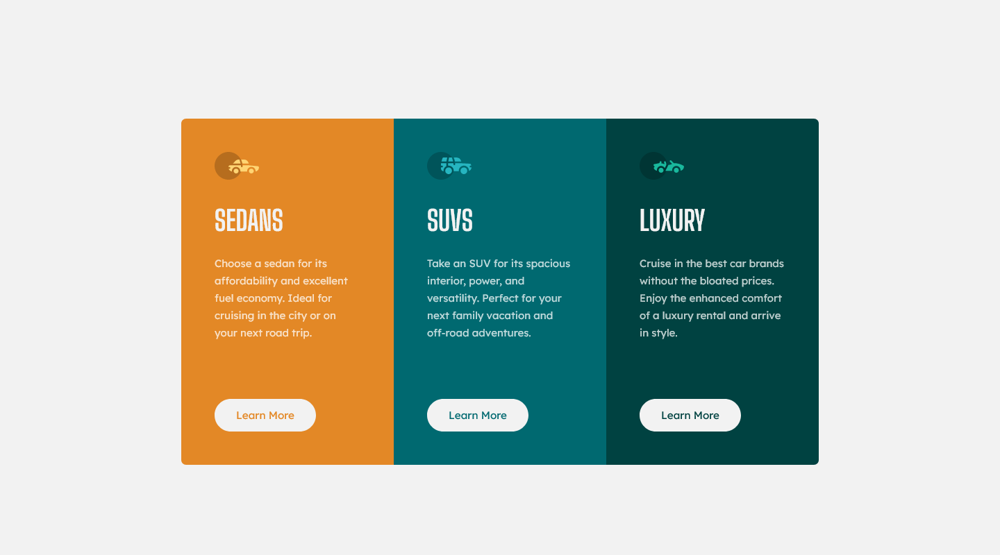

## Frontend Mentor Challenge 02 - 3-Column Preview Card Component

This is a solution to the [3-column preview card component challenge on Frontend Mentor](https://www.frontendmentor.io/challenges/3column-preview-card-component-pH92eAR2-). Frontend Mentor challenges help you improve your coding skills by building realistic projects.

### Screenshots of my solution

#

### Links
- Live Site URL: https://3-column-preview-card-component-darkstarxdd.vercel.app/
- Solution URL: https://www.frontendmentor.io/solutions/3column-preview-card-component-et9Z1kSS1b
#

### Built with
- HTML5 / CSS
- CSS Flexbox
- CSS Grid
#

### New things I learned
- How to use `grid-template-columns` property.
- Not all images need to have text in the `alt` attribute. If you use images as icons for decoration purposes, no need to describe what that image is using an `alt` attribute. In those cases set the `alt` attribute of the `img` to be null. `alt=""`.
#

- My Frontend Mentor Profile - [@DarkstarXDD](https://www.frontendmentor.io/profile/DarkstarXDD)
